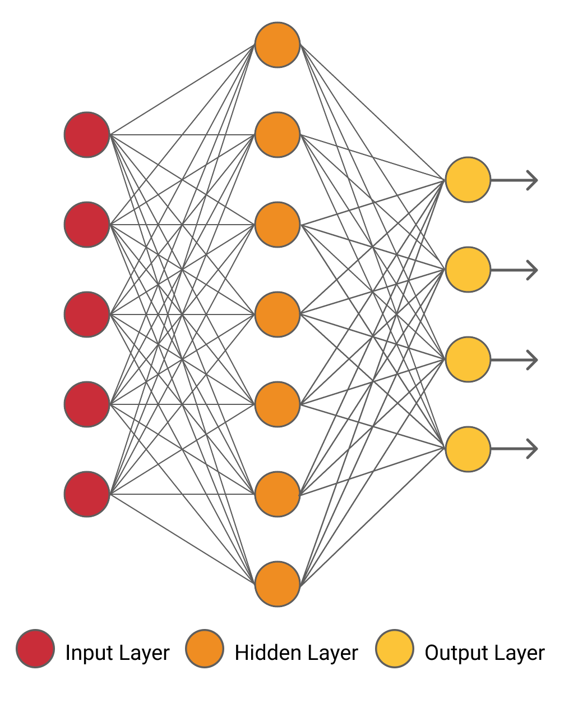
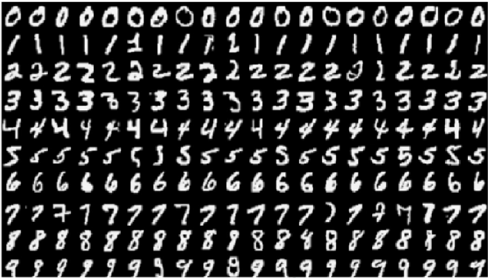

# DeepLearning
Small deep learning projects for learning, practicing PyTorch and creating my own ChatGPT.

## Table of Contents

- [Image Recognition](#image-recognition)
  - [Multi-layer Percetron](#mlp)
  - [Convolutational Neural Nets](#cnn)
- [Natural Languague Processing](#nlp)
- [Reinforcement Learning](#rl)

# image-recognition
[(Back to top)](#table-of-contents)

Comparison between MLP and CNN

## mlp

Add some pictures, details and table with results

<!--  -->

<!--  -->

This table compares the accuracy obtained (in the validation set) with different learning rates and epochs used in the training process.

| Learning Rate / #Epochs | 1     | 4     | 8     | 16    |
|-------------------------|-------|-------|-------|-------|
| 0.05                    | 91.30% | -- | -- | -- |
| 0.10                    | 93.00% | -- | -- | -- |
| 0.20                    | 94.25% | -- | -- | -- |
| 0.30                    | 95.20% | 97.57% | **98.13%** | 98.11% |
| 0.40                    | 94.78% | -- | -- | -- |

It indicates that the performance begins to stall for learning rates beyond 0.3 and that adding more than 8 epochs does not seem to improve the performance.

## cnn

Add some pictures, details and table with results

# nlp
[(Back to top)](#table-of-contents)

Natural Language Processing

# rl
[(Back to top)](#table-of-contents)

Reinforcement Learning